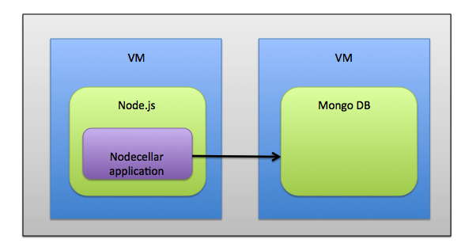

---
layout: bt_wiki
title: Cloudify Blueprint Guide
category: Tutorials
publish: false
abstract: Blueprint authoring tutorial
pageord: 200
--- 
 {{page.abstract}}

#Overview
In this tutorial we will create a blueprint that will describe the topology of the Nodecellar application. The Nodecellar application is a Node.js web application of wine catalog
It includes the following components:

**Infrastructure:**

- Two hosts (we will call them nodejs_host and mongodb_host) that contain the application. One contains the Node.JS and the other the MongoDB. In this tutorial we will use mock hosts (we make Cloudify report 2 hosts that are not really out there) as we want to install the entire application on our Vagrant VM

**Middleware:**

- [Node.JS](http://nodejs.org/) - This is a javascript based application server that serves this web application - It is contained within the nodejs_host 

- [MongoDB](http://www.mongodb.org/) - This is a JSON document store that serves as the application database - It is contained within the mongodb_host

**Application:** 

- Nodecellar - This is the application business logic packed as Node.JS application. It is hosted within the Node.JS server. It needs a connection to the MongoDB Database

The topology would look like this:

##Cloudify YAML DSL

Cloudify Domain Specific Language (DSL) is written in YAML. If you are not familiar with yaml you may want to read the [yaml documentation](http://www.yaml.org/start.html) first

#Step 1: Creating the blueprint

First lets create a folder with the name of nodecellar and create a blueprint.yaml file within it. This file is the blueprint file

Now lets declare the name of this blueprint

blueprint:
    name: nodecellar


Now we can start the topology. The topology is a yaml object called nodes. Its value is a yaml list.

blueprint:
    name: nodecellar
    nodes:


#Step 2: Creating a host for the Node.JS

Lets add the nodejs_host as the first node in the list of nodes. To do so we need first a type as each node is an instance of a type.
Types are like classes in an OO program. They represent a type of component in an application at any level: Infrastructure (hosts, networks etc), middleware (application servers, web servers etc) or application (application modules, database schemas etc.).

Types can be imported from external files or declared inside the blueprint.yaml file. 

In this case we will use a type from an external URL. Since we are not really going to spawn a VM, we will use the basic type of `cloudify.types.host` . This type can get an IP of an existing host (in our case it will be the manager IP) and install the Cloudify agent on it.  We will use this functionality to simulate the hosts in our application and in order to demonstrate how Cloudify uses application agent plugins such as the bash plugin.

In order to use this type we need to add the following yaml in our blueprint file


imports:
	 - http://www.getcloudify.org/spec/cloudify/3.0/types.yaml
	


This file contains the declaration of the type:


types:
  cloudify.types.host:
        derived_from: cloudify.types.base
        interfaces:
            cloudify.interfaces.worker_installer:
                - install: worker_installer.tasks.install
                - start: worker_installer.tasks.start
                - stop: worker_installer.tasks.stop
                - uninstall: worker_installer.tasks.uninstall
                - restart: worker_installer.tasks.restart
            cloudify.interfaces.plugin_installer:
                - install: plugin_installer.tasks.install
            cloudify.interfaces.host:
                - get_state
        properties:
            - install_agent: true
            - cloudify_agent: {}
            - ip: ''   



The type has interfaces with operations (hooks) that are implemented using plugins functions. 

Plugins are python facades for APIs and tools you would like to use (such as IaaS compute API or tools like Chef and Puppet).

In this case you see 2 plugins:
- worker_installer: a manager side plugin that is responsible to SSH into the host and create the Cloudify agent
- plugin_installer: an agent side pluign that installs the agent plugins used in this blueprint on the current agent

in order to use the agent_installer, we will need a private key file on our manager host (this happens as part of the manager creation process). 

The `host` type also declares configuration schema (properties that must have values). In this case it decvalres the install_agent with default value of truth, the cloudify_agent map with default empty map and the ip propety with default value of empty string.

now let's add the nodejs_vm node that uses the type:


	-   name: nodejs_vm
	    type: cloudify.types.host
      properties:
        ip: 127.0.0.1
        cloudify_agent:
          key:



The above yaml snippet specifies an anonymous yaml map with the following keys:
name - the name of the node (in this case nodejs_host)
type - the type of component this node is instance-of.
properties - the conbfiguration of this instance. 

Under properties you can see 2 key-value pairs:
ip - in this case is localhost as we are installing the agent on the local host only simulating another host
cloudify_agent - is a sub map with the agent configuration. here we specify the private key path.

#Step 3: Adding a host for the Mongo DB
In similar manner we add should now add the mongod_vm node (it is a simple copy and paste with a different name)


	-   name: mongod_vm
	    type: cloudify.types.host
      properties:
        ip: 127.0.0.1
        cloudify_agent:
          key:



#Step 4: Creating Mongo Database

Now let’s add the middleware nodes of the application. In this blueprint we are using the bash types, that uses the bash plugin to install and start the nodes.

The first node we will add is the mongod node that represents the Mongo database server. The type we will use here is cloudify.bash.db_server. This type is imported from the bash plugin types and use the bash plugin to execute scripts listed in the node configuration (under mandatory property scripts).

The reason why we have specific types for db_server, app_server etc. is that we want the user to be able to differentiate between nodes based on their role in the application. We therefore using marking types.

We need to import the bash types and plugins to use this type. The below decalration is at the begining of the file


imports:
    - http://www.getcloudify.org/spec/bash-plugin/1.0/plugin.yaml



Now we can declare the mongod node:


- name: mongod
      type: mongo_database
      properties:
            role: mongod
            port: 27017
            scripts:           
                create: mongo-scripts/install-mongo.sh
                start: mongo-scripts/start-mongo.sh
                stop: mongo-scripts/stop-mongo.sh



What we see here is the scripts property which is a map of scripts mapped to lifecycle events. In this case we see the create event mapped to mongo-scripts/install-mongo.sh

a script uploaded with the blueprint under the subfolder of mongo-scripts. The plugin has API to fetch this file from Cloudify manager fileserver and use it. The bash plugin knows which lifecycle event was assigned to the agent by the workflow engine and search the scripts dictionary for the right script name and path.

#Step 5: Refining the blueprint using mongo custom type

We have just declared a mongod node of type cloudify.bash.db_server. This type doesn’t enforce any properties except for scripts. In the case of mongo database we probably need to make sure the user give us configuration details such the role in the mongo cluster and the port to which it listens. We will therefore subtype cloudify.bash.db_server and add schema properties declarations



mongo_database:
        derived_from: cloudify.types.bash.db_server
        properties:
            -   role
            -   port



So now our mongod node will look like this:



- name: mongod
      type: mongo_database
      properties:
            role: mongod
            port: 27017
            scripts:           
                create: mongo-scripts/install-mongo.sh
                start: mongo-scripts/start-mongo.sh
                stop: mongo-scripts/stop-mongo.sh


      

Finally we need to add the mongod relationships. This node has only one relationship - it is contained in the mongod_host node (In reality it is not in this deployment as the host is a mock)


- name: mongod
      type: mongo_database
      properties:
            role: mongod
            port: 27017
            scripts:           
                create: mongo-scripts/install-mongo.sh
                start: mongo-scripts/start-mongo.sh
                stop: mongo-scripts/stop-mongo.sh
      relationships:
        - target: mongod_vm
          type: cloudify.relationships.contained_in



#Step 6: Creating the Node.JS Server

Now we can declare the nodejs node:


- name: nodejs
      type: cloudify.bash.app_server
      properties:
            scripts:           
                create: nodejs-scripts/install-nodejs.sh
      relationships:
        - type: cloudify.relationships.contained_in
          target: nodejs_vm



This is similar to the mongod node. It uses a bash type (cloudify.bash.app_server).
It uses the same type of relationship (cloudify.relationships.contained_in
) but it’s located in the other vm node.

#Step 7: Refining the Node.JS type:

We can refine this node as well by using a subtype in case we want specific properties in the future. The subtype will look like this:


nodejs_server:
        derived_from: cloudify.types.bash.app_server


as a result the final version of the nodejs node is:


- name: nodejs
      type: nodejs_server
      properties:
            scripts:           
                create: nodejs-scripts/install-nodejs.sh
      relationships:
        - type: cloudify.relationships.contained_in
          target: nodejs_vm



Now let’s try and deploy what we have created so far to get a fill of it

#Step 8: Adding the application layer
we can now add the application layer by adding the nodecellar_app node. it is of type nodejs_app (which again we need to decalre inline)


nodejs_app:
    derived_from: cloudify.types.bash.app_module
    properties:
        -   app_name
        -   startup_script
        -   git_url
        -   git_branch
        -   base_port
        -   num_instances
        -   env_file_path


And now we can add the node in the nodes list


 - name: nodecellar_app
      type: nodejs_app
      properties:
            app_name: nodecellar
            startup_script: server.js
            git_url: https://github.com/uric/nodecellar.git
            git_branch: master
            base_port: 8080
            num_instances: 1
            env_file_path: /tmp/mongo_host_and_port.sh
            scripts:           
                create: nodejs-scripts/install-app.sh
                start: nodejs-scripts/start-app.sh
                stop: nodejs-scripts/stop-app.sh
      relationships:
        - type: cloudify.relationships.contained_in
          target: nodejs



Again note the bash scripts used to install the application.  This node has a contained_in relationship to the nodejs node which means that it will be deployed inside the node.js server
Lets deploy again and see the entire application stack but without the db connection yet

#Step 9: Connecting the Node.JS application to the mongo DB 

We need to connect the node.js application to the mongo database to make it fully functional. To do so we need a plugin that will get the runtime details of the mongod node and will configure the nodecellar_app node. The plugin API gets both nodes details in the context of a relationship from the workflow engine, so it is easy to code such a plugin. In this case we are going to use a custom plugin called nodecellar_config_plugin.

This plugin is declared in the following manner:


plugins:
    nodecellar_config_plugin:
        derived_from: cloudify.plugins.agent_plugin
        properties:
            folder: nodecellar-config-plugin



We need to add now a custom relationship that will inherit from connected_to abstract relationship type and will use the plugin.


relationships:
    nodecellar_connected_to_mongo:
        derived_from: cloudify.relationships.connected_to
        source_interfaces:
            cloudify.interfaces.relationship_lifecycle:
                - postconfigure: nodecellar_config_plugin.tasks.get_mongo_host_and_port



Now lets a use of this relationship to the nodecellar_app node. 


- name: nodecellar_app
      type: nodejs_app
      properties:
            app_name: nodecellar
            startup_script: server.js
            git_url: https://github.com/uric/nodecellar.git
            git_branch: master
            base_port: 8080
            num_instances: 1
            env_file_path: /tmp/mongo_host_and_port.sh
            scripts:           
                create: nodejs-scripts/install-app.sh
                start: nodejs-scripts/start-app.sh
                stop: nodejs-scripts/stop-app.sh
      relationships:
        - type: cloudify.relationships.contained_in
          target: nodejs
        - type: nodecellar_connected_to_mongo
          target: mongod    

 

Read the plugins tutorial to gain a better understanding of plugin code

Now let’s deploy the full application

