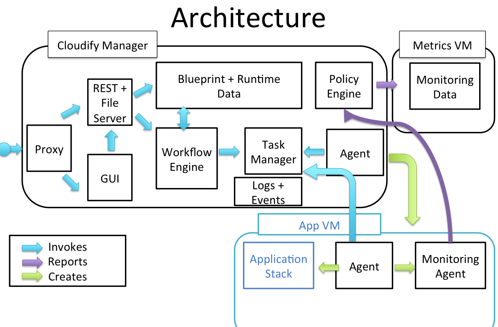
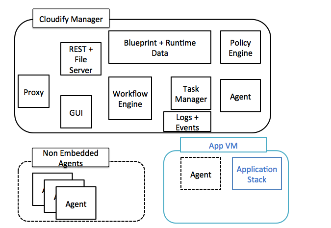
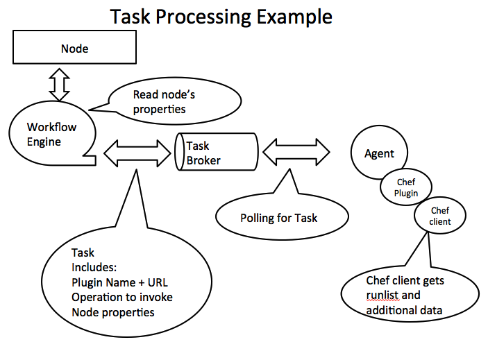

---
layout: bt_wiki
title: How It Works
category: How it works
publish: false
abstract: Explains the architecture and flow of Cloudify 3.0 the DevOps Orchestrator
pageord: 200
--- 
 {{page.abstract}}

# What is Cloudify?

Cloudify is a Cloud Application Orchestrator. It automates any process you need with your applications over any cloud. Starting with environment setup and application installation, going forward to application upgrade, infrastructure upgrade, continuous deployments, auto-heal and auto-scale

Cloudify can work on any environment: IaaS, virtualized or even non virtualized. Cloudify executes automation processes using any tool you choose from shell to chef, puppet etc. Cloudify monitors your application with any monitoring tool you choose; installing it for you if you like and interfacing with your monitoring tools to get events and metrics into Cloudify Policy Engine

# What are Cloudify use cases?

# Architecture
Cloudify 3.0 has a new architecture and a new code base. Cloudify 3.0 is composed of the following main parts:

* **CLI client**
* **Manager (Orchestrator)**
* **Agents**

## The CLI client

The CLI client is an executable (written in Python but packaged with python and dependencies into anexecutable).
The CLI can run on Windows, Linux and Mac OS. The CLI provides 2 main functionalities:

* **Manager Bootstrapping**  - The CLI has components named providers that are responsible for using a particular IaaS API in order to setup the networking, security and VM environment required for the Cloudify manager and installing the manager (using the manager package). This is of course optional functionality as you may install the manager with your prefered tool.

* **Managing Applications** - The CLI serves as a REST client versus the Cloudify manager REST interface. It provides the user with the full set of functionality for deploying & managing applications including log browsing

## The Manager (Orchestrator)
The Cloudify Manager is a stateful orchestrator that deploys and manage applications, decribed in orchestration plans called `blueprints`. The manager main responsibility is to run automation processes described in workflows scripts and issue execution commands to the agents. The manager flows and components are discussed in details below

## The Agents
The Cloudify agents are responsible for managing the manager's command execution using a set of plugins. 
There is a manager side agent per application deployment and optional agent on each application VM.

**The manager side agents** are handling tasks that requires IaaS services (e.g. creating a VM, creating a Network, binding a floating IP to a VM). Manager side agents can also be used with other tools such as `Fabric` or REST to remotely execute tasks.

**The application side agents** are optionally located on applications VM. The user can state in the `blueprint` which VMs will have an agent. The application side agents are installed by the manager side agent as part of the VM creation task. Once running, the application side agent can install plugins and execute tasks locally. Typical tasks will be middleware installaton and configuration and application modules deployments.

## Cloudify Manager Components

### Proxy and File Server

Cloudify uses [`Ngnix`](http://nginx.org/) as its frontend reverse proxy and file server (In later versions in will be used also as a security proxy)

### REST API

Cloudify is controlled via REST API. The REST API covers all the Cloud Orchestration and Management functionality. See [Cloudify REST API Documentation](http://www.cloudifysource.org/cosmo-rest-docs/).
You can use the REST API through Cloudify Non-interactive CLI or write your own REST client.

Cloudify REST controllers are written in python using the [`flask` framework](http://flask.pocoo.org/) and run on a [`GUnicorn` container](http://gunicorn.org/)

### Web GUI
Cloudify Web GUI works vs. the REST API but adds additional value and visibility.

The GUI has the following screens:
* Blueprints screen - a catalog of all uploaded blueprinrs
* Blueprint Screen - a set of views for a particular blueprint including
	* Blueprint Topology
	* Blueprint Network Topology
	* Blueprint Node list
	* Blueprint Source
* Deployments screen
* Deployment Topology screen
* Deployment Network Topology screen
* Deployment Events screen
* Deployment Performance Metrics screen

### Workflow Engine

Cloudify uses a Workflow engine to allow for any automation process through built-in and custom workflows.
The Workflow engine is responsible for timing and orchestrating tasks for creating / manipulating the application components. To achieve that the worflow engine interacts with the Blueprint and runtime data to get the properties and plugin information and writes tasks to the task broker.
Cloudify wroflow engine uses workflows written in a mini language called [Radial](http://ruote.rubyforge.org/definitions.html#radial)

### Runtime Model

Cloudify uses [Elastic Search](http://http://www.elasticsearch.org/) as its data store for deployment state. The deployment model and runtime data are stored as JSON documents. The runtime model includes the following information:

<!-- ## <a name="Metrics Database">Metrics Database</a> -->

<!-- CLoudify uses [Graphite](http://graphite.readthedocs.org/en/latest/overview.html) to persist and aggregate the application availability and performance metrics.

Cloudify users don't need to access Graphite API directly in order to consume the persisted data. Cloudify exposes all the metreics data through REST API and Web GUI.

Typically, the Graphite server is installed on a dedicated host. [You can configure the location of your graphite server during bootstrap](#) -->

## Policy Engine

Cloudify offers a policy engine that runs custom policies in order to make runtime decisions about availability, SLA, etc. For example, during installation, the policy engine consumes streams of events coming from monitoring probes or tools. The policy engine analyze these stream to decide if a specific node is up and running and provides the required functionality. The results of such "start detection" policy are fed into the runtime model.

Cloudify uses [Riemann.IO CEP](http://riemann.io/) as the core of the policy engine component. Cloudify user doesn't need to acces or config Riemann directly. The Policies are registered, activated, deactivated and deleted by the Workflow Engine as part of the orchestration process.

<!--The policies are written in [Clojure](http://clojure.org/). Riemann offers many [built it functions for analyazing monitoring information](http://riemann.io/api.html).
Cloudify offers policy examples for the common use cases.-->

### Tasks Broker

Cloudify uses [Celery](http://www.celeryproject.org/) with [RabbitMQ](http://www.rabbitmq.com/) message bus to manager task distribution and execution.
Cloudify tasks contain the blueprint information and the runtime information (if applicable) of the relevant node, the plugin (name and URL) that will execute the task and the operation name this plugin need to execute.

Cloudify agents that are based on Celery workers listen to the RabbitMQ queues to obtain tasks they need to execute (see more information below). Once a message arrive, they invoke the task and report back.

### Tasks
Task is a bit overloaded term - it is a step in the Workflow and for Celery it means an extension to execute
In this documentation we refer to the former as a task and to the later as a plugin (at least as the plugin python facade)

### Agents

Cloudify agents are based on [`celery daemons & workers`](http://www.celeryproject.org/). an agent can be located remote to the Node it manipulates (by default on the Cloudify Manager VM) or collocated on the same host. Manager side agents are one (by default) or more per deployment.
Cloudify manager side agents are used typically to execute IaaS API invocation tasks (such as host creation) and other remote tasks (such as agent installation using SSH on new application hosts).

Cloudify agents perform the following functionality:
* **Plugin Installation** - The agent gets instructions about the plugins it should use and load them. Plugins can be added dynamically at runtime
* **Operation Execution** - The agents get tasks from the workflow that are instruction for Operation (method) execution on a specific plugin. The agent assigns one of its workers to handle the task

### Plugins
Plugins are python facades for any third party tool you want to use with any Cloudify workflow execution. Notable examples are plugins for IaaS APIs, plugins for Configuration Management tools and even plugins for installation of monitoring agents

The plugin has methods that correspondes to Node Interface Operations. These methods are decorated with `@operation` decorator and get the `context` argument that holds handlers to node runtime properties, the plugin logger, and in case of a relationship task to the other Node in the relationship.

 

### Logs and Events
Cloudify offers logs & events as the maintroubleshooting and tracing tools:
* **Events** - Cloudify report user facing events for any step in workflow and task execution. The events are in JSON format and have all the relevant context included.
* **Logs** - Cloudify has a logger that enriches log entries with all relevant context information.

### Log & Event gathering mechanism
Cloudify has built-in mechanism for log & events gathering, indexing and persisiting.
This mechanism is currently used for Cloudify logs but will be extended to support application logs later. The mechanis is composed of [RabbitMQ](http://www.rabbitmq.com) as the main transport and queueing component. [Logstash](http://http://logstash.net/), as the means to format and enrich logs (so we can format and pipe them in various formats for different integrations) and [Elastic Search](http://http://www.elasticsearch.org/) as the log and events indexing mechanism

To enjoy the benefits of this mechanism, the REST API exposes some methods to run queries on Elastic Search and other methods for getting events and logs for a particular workflow execution.

# Cloudify Technical Scenarios

Cloudify architecture supports the following main technical flows

## Bootstrap
Bootstrapping is when a user chooses to install the manager using the CLI. In this process the CLI sets up the environment needed for the manager (network, security groups and key-pairs and the manager VM). Once the manager VM is ready, the CLI uses the manager package to install the manager components inside the manager VM.

## Blueprint Upload
The first step for the user must take to install an application is to have the application orchestration plan (aka `blueprint`) uploaded to the manager and saved in its `file server`. This is done by using the GUI or the `cfy blueprints upload` command. The CLI then packs the blueprint YAML file folder to a `tar` file and uploads it through the Cloudify manager REST server. It is then stored in the Cloudify manager file server ([ngnix](ngnix.org))

## Deploymeny Creation
In order to deploy and manage an application you need to create a runtime data model in the manager. This is where the manager keeps the state of the application. To do so simply use the GUI or the CLI command: `cfy deployments create`

## Workflow Execution

Any automation process from initial setup to auto-scale is performed by running a workflow script.
In order to execute a workflow use the GUI or the CLI command `add here`

Workflow execution requires the Workflow itslef and a [Topology](#topology)
The Workflow engine runs the worflow algorithm and in each step process the selected Nodes. For each node it creates a task for an agent to execute. The task has the implementation information for the agent:
* Which pluign to use and how to get it (URL)
* Which method in the plugin to invoke
* A dictionary of the `node properties` taken from the `blueprint`. 
* Runtime information about nodes on which the current node is dependent so relationships can be configured

The designated agent (Manager Side or Application VM side depending on the task) gets the taks from the queue and starts executing it. It will usually install a plugin or use an installed plugin. It will execute the task by invoking the plugin method specified in the task. 

# Supported Clouds & Tools

## Clouds and Virtualization

<table>
<tr>
<th>Cloud</th>
<th>Supported APIs</th>
</tr>
<tr>
<td>OpenStack</td>
<td>
<ul>
<li>Nova</li>
<li>Neutron</li>
<li>Cinder</li>
</ul>
</td>
</tr>
<tr>
<td>Vagrant</td>
<td>Virtual Box</td>
</tr>
</table>

## DevOps Tools

<table>
<tr>
<th>Tool</th>
<th>Coverage</th>
</tr>
<tr>
<td>Chef</td>
<td>Chef client</td>
</tr>
<tr>
<td>Puppet</td>
<td>Puppet Master &amp; Agent mode</td>
</tr>
<tr>
<td>Fabric</td>
<td> -- </td>
</tr>
</table>
